# Software development process skills

This repository holds **Cursor agent skills** for a full build cycle: grounding work in the codebase, shaping requirements, planning, implementing, reviewing, archiving, and improving the process itself. The goal is more reliable, consistent, and higher-quality output by giving the agent explicit stages, artifacts, and handoffs.

## Using these skills in Cursor

Skills are folders that contain a main instruction file. Cursor expects:

- **Personal:** `~/.cursor/skills/<skill-name>/SKILL.md`
- **Project:** `.cursor/skills/<skill-name>/SKILL.md`

Each skill folder’s entry file is **`SKILL.md`** (Cursor’s required name). Symlink or copy each folder into **`~/.cursor/skills/<skill-name>/`** or **`.cursor/skills/<skill-name>/`** in a project. A **symbolic link** to this repo’s `software-development-skills/<name>/` folder is more reliable than a macOS Finder alias.

Invoke skills by asking the agent in natural language (e.g. “run `/plan` for this PRD”) or whatever slash-command style you use in your setup. Each skill’s **`description`** in frontmatter includes slash-style trigger hints (e.g. `/ideate`) so the agent can match intent.

---

## Recommended cycle

Typical order:

1. **`/context-gathering`** (optional but useful) — Map the relevant area of the codebase.
2. **`/ideate`** — Interview, then produce a signed-off **PRD** (creates **`.features/current/`** if needed before saving).
3. **`/plan`** — Turn the PRD into a phased **implementation plan**; sign-off before build.
4. **`/implement`** — Execute the plan task-by-task, tests alongside work; **implementation summary**.
5. **`/teach`** (optional) — After implementation, get a structured explanation of what was built and why.
6. **`/review`** — Best in a **fresh chat**: cold read of code against PRD, plan, and summary; structured findings.
7. **`/document`** — Collate artifacts into **`.features/[date_name]/`** and a readable **overview** plus index.
8. **`/retro`** (after a full cycle) — Meta review: how well the *skills* worked; proposed edits to skill files (you apply them).

---

## Skills in this repo

| Command | Skill | Role |
|--------|--------|------|
| `/context-gathering [area]` | **context-gathering** | Scans a path or domain and writes a structured **context map** to **`.features/current/context-map-[area].md`**, plus a short session summary so later steps match real patterns and config. |
| `/ideate` | **ideate** | Structured **interview** (small batches of questions), then a full **PRD** and refinement pass; explicit **sign-off** before planning. Saves `1_ProductRequirementsDocument.md` under `.features/current/`. |
| `/plan` | **plan** | Reads the PRD (and context you’ve loaded); produces an **adaptive** phased plan (no boilerplate sections); refinement pass; **sign-off** before `/implement`. Saves `2_Plan.md` under `.features/current/`. |
| `/implement` | **implement** | Requires a signed-off plan; executes **phase → task** order; **tests with each task**; stops on real ambiguity; saves `3_Implementation.md` under `.features/current/`. No scope improvisation or drive-by refactors. |
| `/teach` | **teach** | **Code explainer**: after an implementation, walks through what was built, why, and key concepts — pitched at someone learning to code, not just using it. |
| `/review` | **review** | **Second-agent, cold** review: PRD/plan/summary + code; checklist (alignment, correctness, patterns, edge cases, tests, security, performance, a11y, etc.); severity-ranked issues; saves `4_Review.md` under `.features/current/`. |
| `/document` | **document** | **Archivist**: gathers PRD, plan, impl summary, review; builds **`.features/YYYY-MM-DD_Name/`** with a standalone **`0_Overview.md`** and maintains a **`.features/README.md`** index. |
| `/retro` | **retro** | **Process audit** (not product quality): which skills felt wrong, evidence from artifacts + your experience; per-skill assessment; **plain-English change list** — does **not** edit skill files without your approval. |

---

## Where artifacts land

| Location | Contents |
|----------|----------|
| **`.features/current/context-map-[area].md`** | Context maps from `/context-gathering`. |
| **`.features/current/`** | Symlink to the active cycle's dated folder; all skills read/write here. |
| **`.features/YYYY-MM-DD_Name/`** | Numbered artifacts for one cycle: `1_ProductRequirementsDocument.md`, `2_Plan.md`, `3_Implementation.md`, `4_Review.md`, and (on `/document`) `0_Overview.md`. |
| **`.features/README.md`** | Index of all completed feature cycles; maintained by `/document`. |

Exact filenames are defined inside each skill; keep naming consistent so `/plan`, `/implement`, `/document`, and `/retro` can find evidence of the cycle.

---

## Status

These skills are written as a **coherent prototype pipeline**. `/retro` is explicitly there to tighten them based on real use. Adjust `SKILL.md` files as you learn what works for your team and stack.
